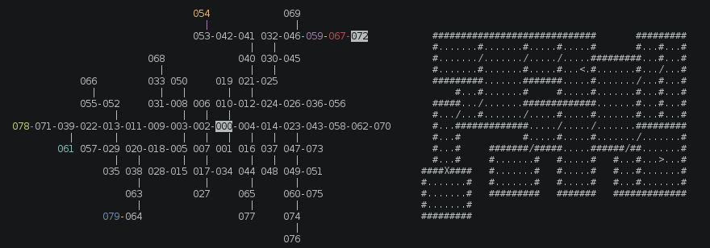
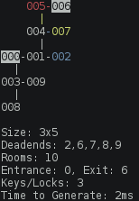
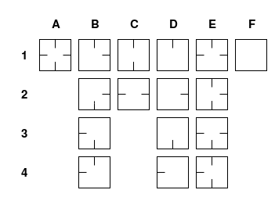

# Roguelike Level Generators



This repository contains multiple 2D "dungeon" level generator algorithms.
Depending on the genre of game you're building, one algorithm will be better than another.

```sh
npm install roguelike
```

##### Table of Contents

* [Classic Roguelike Level Generator](#level-roguelike)
* [Grid with Keys and Locks Level Generator](#level-gridKeys)

<a name="level-roguelike"></a>
## `roguelike/level/roguelike`: Classic Roguelike Level Generator

The concept is simple, inspired by sliding system used by [Brogue](https://www.rockpapershotgun.com/2015/07/28/how-do-roguelikes-generate-levels/).
Random rooms are generated, and slid into the level in a random direction until they collide with an existing room.
Once they collide a door is generated randomly in the colliding surface.
We only generate rooms on odd rows and columns so that everything fits together perfectly.

This generator is useful when you care about every wall and room and you want them to fit together in interesting ways.

### Example Generated Level

This is a simple visual representation (visualized using `test/level/roguelike.js`).

```
    #########    
    #.......#    
    #.......#####
    #.......#...#
#####.......X...#
#.../.......#...#
#...####/####...#
#.<.# #...# #...#
#...# #.>.# #####
#...# #...#      
##### #####      

```

In the above diagram, a `.` period represents floor, a `#` octothorp represents a wall, a `/` forward slash represents a normal door, and a `X` capital X represents a special door.
The entrance to the level is a `<` less than symbol and the exit is a `>` greater than symbol.

### Usage

```javascript
const LevelRoguelike = require('roguelike/level/roguelike');

let level = LevelRoguelike({
  width: 17, // Max Width of the world
  height: 11, // Max Height of the world
  retry: 100, // How many times should we try to add a room?
  special: true, // Should we generate a "special" room?
  room: {
    ideal: 5, // Give up once we get this number of rooms
    min_width: 3,
    max_width: 7,
    min_height: 3,
    max_height: 7
  }
});

console.log(level);
```

### Example Output

A typical level takes about **3ms** to generate on my laptop. YMMV.

A **special** room can be used for whatever you want. I like to use them for shops and hidden rooms (you'll know when a door is special, too).

The `world` attribute is entirely optional for you to use. All the data within it can be recreated using the other attributes.

#### Output JSON

```javascript
{
  "width": 17, // Maximum units wide the world needs to fit within (could be less)
  "height": 11, // Maximum units tall the world needs to fit within (could be less)
  "enter": {
    "room_id": 1,
    "x": 2,
    "y": 7
  },
  "exit": {
    "room_id": 2,
    "x": 8,
    "y": 8
  },
  "deadends": [], // List rooms with a single door, NOT including enter/exit/special
  "special": {
    "room_id": 2,
    "door_id": 1
  },
  "door_count": 3,
  "doors": {
    "0": {
      "id": 0,
      "rooms": [ 0, 1 ],
      "x": 4,
      "y": 5,
      "enter": true
    },
    "1": {
      "id": 1,
      "rooms": [ 0, 2 ],
      "x": 8,
      "y": 6,
      "exit": true
    },
    "2": {
      "id": 2,
      "rooms": [ 0, 3 ],
      "special": true,
      "x": 12,
      "y": 4
    }
  },
  "room_count": 4,
  "rooms": {
    "0": {
      "doors": [ 0, 1, 2 ],
      "height": 5,
      "id": 0,
      "left": 5,
      "neighbors": [ 1, 2, 3 ],
      "top": 1,
      "width": 7
    },
    "1": {
      "doors": [ 0 ],
      "height": 5,
      "id": 1,
      "left": 1,
      "neighbors": [ 0 ],
      "top": 5,
      "width": 3,
      "deadend": true,
      "enter": true
    },
    "2": {
      "doors": [ 1 ],
      "height": 3,
      "id": 2,
      "left": 7,
      "neighbors": [ 0 ],
      "top": 7,
      "width": 3,
      "deadend": true,
      "exit": true
    },
    "3": {
      "doors": [ 2 ],
      "height": 5,
      "id": 3,
      "left": 13,
      "neighbors": [ 0 ],
      "special": true,
      "top": 3,
      "width": 3,
      "deadend": true
    }
  },
  "walls": [ // X/Y coordinates of every wall in the map
    [4, 0],
    [4, 1],
    [4, 2],
    [10, 10]
    // ... Truncated List of Walls ...
  ],
  "world": [
    [ 0, 0, 0, 0, 2, 2, 2, 2, 2, 2, 2, 2, 2, 0, 0, 0, 0 ],
    [ 0, 0, 0, 0, 2, 1, 1, 1, 1, 1, 1, 1, 2, 0, 0, 0, 0 ],
    [ 0, 0, 0, 0, 2, 1, 1, 1, 1, 1, 1, 1, 2, 2, 2, 2, 2 ],
    [ 0, 0, 0, 0, 2, 1, 1, 1, 1, 1, 1, 1, 2, 1, 1, 1, 2 ],
    [ 2, 2, 2, 2, 2, 1, 1, 1, 1, 1, 1, 1, 4, 1, 1, 1, 2 ],
    [ 2, 1, 1, 1, 3, 1, 1, 1, 1, 1, 1, 1, 2, 1, 1, 1, 2 ],
    [ 2, 1, 1, 1, 2, 2, 2, 2, 3, 2, 2, 2, 2, 1, 1, 1, 2 ],
    [ 2, 1, 5, 1, 2, 0, 2, 1, 1, 1, 2, 0, 2, 1, 1, 1, 2 ],
    [ 2, 1, 1, 1, 2, 0, 2, 1, 6, 1, 2, 0, 2, 2, 2, 2, 2 ],
    [ 2, 1, 1, 1, 2, 0, 2, 1, 1, 1, 2, 0, 0, 0, 0, 0, 0 ],
    [ 2, 2, 2, 2, 2, 0, 2, 2, 2, 2, 2, 0, 0, 0, 0, 0, 0 ]
  ]
}
```

#### World Matrix Cell Types

|TYPE           | ID |
|---------------|----|
|VOID           | 0  |
|FLOOR          | 1  |
|WALL           | 2  |
|DOOR           | 3  |
|SPECIAL DOOR   | 4  |
|ENTER          | 5  |
|EXIT           | 6  |


### Caveats

* Rooms must be odd sized, and at least 3 units wide/tall
* World should likewise be odd sized
* Weird things will happen if you try to generate rooms larger than the world


<a name="level-gridKeys"></a>
## `roguelike/level/gridKeys`: Grid with Keys and Locks Level Generator

Unlike the Roguelike level generator, this level generator doesn'actually care about the content of each "room".
These rooms could be Zork/Adventure style, where a room is a field or a whole building or a room.
If specified, this level generator will lock doors and place keys throughout the level.

### Example Generated Level



In this diagram, numbers are rooms, with room 000 being the entrance and room 006 the exit.
If a room is colored than the room contains a key.
A `-` hyphen or `|` pipe represents a door between two rooms.
If the door is colored it means that door is locked.

### Usage

```javascript
const LevelGridKeys = require('roguelike/level/gridKeys');
const level = new LevelGridKeys({rooms: 10, keys: 3});
let result = level.generate();
console.log(result);
```

### Room Types

Each room will contain a `template` field.
This is a convenience for figuring out which prefabricated room designs you would like to use.
This diagram explains the design of each room.
In theory you can simply design one level for each letter and then rotate them for each number.



### Example Output

```javascript
{
  // The bounds of the level will fit within this many room units
  "size": {
    "height": 6,
    "width": 3
  },

  // The entrance and exit are important. The deadends isn't as useful.
  "terminals": {
    "deadends": [ 2, 6, 7, 8, 9 ],
    "entrance": 0,
    "exit": 8
  },

  // Here is a 2D grid of the map, stored as Y[X]. Numbers represent Room IDs
  "grid": [
    [ 7, 0, 2 ],
    [ 6, 1, null ],
    [ null, 3, null ],
    [ 9, 4, null ],
    [ null, 5, null ],
    [ null, 8, null ]
  ],

  // This is an array of keys.
  // door = ID of door this key unlocks
  // id = ID of this specific key (always matches array index)
  // location = ID of room where this key is located
  "keys": [
    {
      "door": 7,
      "id": 0,
      "location": 5
    },
    {
      "door": 4,
      "id": 1,
      "location": 9
    },
    {
      "door": 8,
      "id": 2,
      "location": 4
    }
  ],

  // This is an array of all doors
  // exit = Whether this door leads to an exit room
  // id = ID of this door (always matches array index)
  // key = ID of the key required to unlock this door
  // orientation = Whether this door is (v)ertical or (h)orizontal
  // rooms = Array of room IDs this door connects to
  "doors": [
    {
      "exit": false,
      "id": 0,
      "key": null,
      "orientation": "v",
      "rooms": [ 0, 1 ]
    },
    {
      "exit": false,
      "id": 1,
      "key": null,
      "orientation": "h",
      "rooms": [ 0, 2 ]
    },
    {
      "exit": false,
      "id": 2,
      "key": null,
      "orientation": "v",
      "rooms": [ 1, 3 ]
    },
    {
      "exit": false,
      "id": 3,
      "key": null,
      "orientation": "v",
      "rooms": [ 3, 4 ]
    },
    {
      "exit": false,
      "id": 4,
      "key": 1,
      "orientation": "v",
      "rooms": [ 4, 5 ]
    },
    {
      "exit": false,
      "id": 5,
      "key": null,
      "orientation": "h",
      "rooms": [ 1, 6 ]
    },
    {
      "exit": false,
      "id": 6,
      "key": null,
      "orientation": "h",
      "rooms": [ 0, 7 ]
    },
    {
      "exit": true,
      "id": 7,
      "key": 0,
      "orientation": "v",
      "rooms": [ 5, 8 ]
    },
    {
      "exit": false,
      "id": 8,
      "key": 2,
      "orientation": "h",
      "rooms": [ 4, 9 ]
    }
  ],

  // Array of rooms used in this map
  // distance = distance from room to spawn. Room 0 is always spawn
  // doors = object containing IDs of doors connected to this room
  // entrance = whether this room is the entrance to the level
  // exit = whether this room is the exit from the level
  // id = ID of this room (always matches array index)
  // keyInRoom = ID of a key which should be located in this room
  // template = shape of this room as doors are concerned, see above
  // x = X Coordinate of this room
  // y = Y Coordinate of this room
  "rooms": [
    {
      "distance": 0,
      "doors": { "e": 1, "n": null, "s": 0, "w": 6 },
      "entrance": true,
      "exit": false,
      "id": 0,
      "keyInRoom": null,
      "template": "E3",
      "x": 1,
      "y": 0
    },
    {
      "distance": 1,
      "doors": { "e": null, "n": 0, "s": 2, "w": 5 },
      "entrance": false,
      "exit": false,
      "id": 1,
      "keyInRoom": null,
      "template": "E4",
      "x": 1,
      "y": 1
    },
    {
      "distance": 1,
      "doors": { "e": null, "n": null, "s": null, "w": 1 },
      "entrance": false,
      "exit": false,
      "id": 2,
      "keyInRoom": null,
      "template": "D4",
      "x": 2,
      "y": 0
    },
    {
      "distance": 2,
      "doors": { "e": null, "n": 2, "s": 3, "w": null },
      "entrance": false,
      "exit": false,
      "id": 3,
      "keyInRoom": null,
      "template": "C1",
      "x": 1,
      "y": 2
    },
    {
      "distance": 3,
      "doors": { "e": null, "n": 3, "s": 4, "w": 8 },
      "entrance": false,
      "exit": false,
      "id": 4,
      "keyInRoom": 2,
      "template": "E4",
      "x": 1,
      "y": 3
    },
    {
      "distance": 4,
      "doors": { "e": null, "n": 4, "s": 7, "w": null },
      "entrance": false,
      "exit": false,
      "id": 5,
      "keyInRoom": 0,
      "template": "C1",
      "x": 1,
      "y": 4
    },
    {
      "distance": 2,
      "doors": { "e": 5, "n": null, "s": null, "w": null },
      "entrance": false,
      "exit": false,
      "id": 6,
      "keyInRoom": null,
      "template": "D2",
      "x": 0,
      "y": 1
    },
    {
      "distance": 1,
      "doors": { "e": 6, "n": null, "s": null, "w": null },
      "entrance": false,
      "exit": false,
      "id": 7,
      "keyInRoom": null,
      "template": "D2",
      "x": 0,
      "y": 0
    },
    {
      "distance": 5,
      "doors": { "e": null, "n": 7, "s": null, "w": null },
      "entrance": false,
      "exit": true,
      "id": 8,
      "keyInRoom": null,
      "template": "D1",
      "x": 1,
      "y": 5
    },
    {
      "distance": 4,
      "doors": { "e": 8, "n": null, "s": null, "w": null },
      "entrance": false,
      "exit": false,
      "id": 9,
      "keyInRoom": 1,
      "template": "D2",
      "x": 0,
      "y": 3
    }
  ]
}
```
